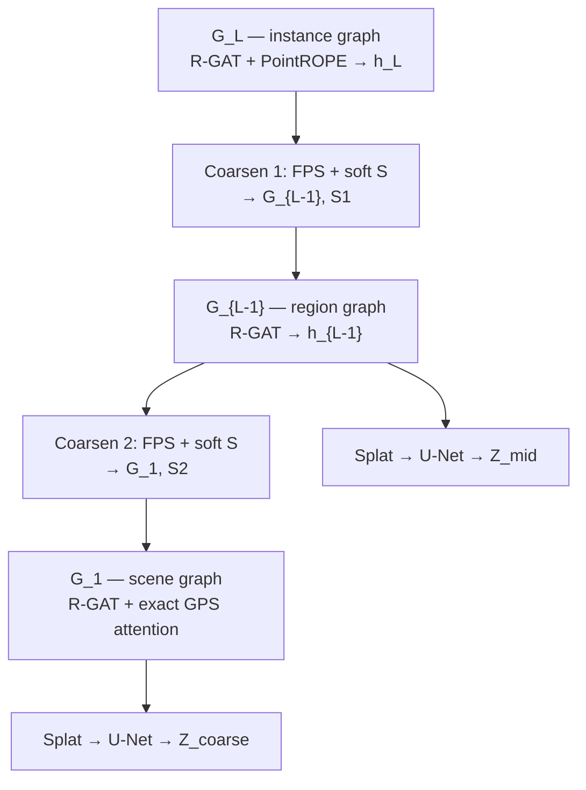

# Architecture

Scene Graph VAE (GVAE): encodes a 3D outdoor scene graph into KL-regularised spatial latent volumes for hierarchical diffusion conditioning.

**Current outputs:** `Z_coarse` (8×8×4), `Z_mid` (16×16×8).  
**Planned (PR2 / Layer A):** `Z_fine` from instance graph `G_L`.

---

## Goal

Compress structured layout (object positions, classes, spatial extent) into dense voxel latents the diffusion model can sample from or condition on. Finer diffusion levels beyond the graph are conditioned on the cascade of coarser diffusion outputs — the graph steps aside after the coarsest conditioned levels.

---

## Input

Each scene graph node carries:

| Field | Description |
|-------|-------------|
| `p` | Centroid in scene-normalised `[-1, 1]³` |
| `r` | Footprint semi-axes (axis-aligned extent) |
| `s` | One-hot semantic vector (15 classes) |
| `label` | Class name string |

Edges: proximity (radius graph on `p`). Road edges are planned but not yet in the loss.

Occupancy ground truth: LiDAR voxelised at mid/coarse resolutions (`occ_mid`, `occ_coarse`), stored as sidecar `.npy` caches.

---

## B policy (non-instantiable classes)

Ground, vegetation, and fence stay on the **instance graph** (`G_L`) for context but are **excluded from coarsening** (`coarsen_mask=False`). Only instantiable objects (cars, poles, trees, etc.) form supernodes and feed `Z_mid` / `Z_coarse`.

Config: `COARSEN_EXCLUDE_NON_INSTANTIABLE=True`, `REMOVE_NON_INSTANTIABLE=False`.

---

## Encoder — three-level chain



### Level 1 — Instance (`G_L`)

- Shallow R-GAT (3 layers) with **PointROPE** on Q/K.
- Feature dim `D_INSTANCE = 72`.

### Coarsening (`G_L → G_{L-1}` and `G_{L-1} → G_1`)

- **FPS** selects supernode seeds (`REDUCTION_RATIO = 0.03`).
- **Hard assign**: nearest seed (Voronoi); used for footprint bbox.
- **Soft assign `S`**: MLP over normalised distances → softmax; used for pool loss and feature pooling.
- **`S.detach()`** on the feature path (`p`, `s`, `h_pooled`) so recon gradients do not destabilise `mlp_S`; pool loss still trains `S`.
- Supernode attrs: weighted `p`, soft-mixed `s`, AABB `r`, ball-query edges.

### Level 2 — Region (`G_{L-1}`)

- R-GAT on coarsened graph; init from pooled `h` + geometry.
- `D_REGION = 144` → splat → deeper 3D U-Net → `Z_mid`.

### Level 3 — Scene (`G_1`)

- R-GAT + exact multi-head attention (GPS layer); ~10–30 nodes.
- `D_SCENE = 288` → splat → shallower U-Net → `Z_coarse`.

### Splatting + U-Net

- Anisotropic Gaussian splat, truncated at ±2σ, `scatter_add` normalisation.
- 3D U-Net with **GroupNorm** (batch=1 scenes; BatchNorm is unsuitable).
- Variational head: `(μ, log σ²)` per voxel; sample `Z = μ + σ ⊙ ε`.

| Output | Grid | Voxels | Latent dim |
|--------|------|--------|------------|
| `Z_mid` | 16 × 16 × 8 | 2 048 | 144 |
| `Z_coarse` | 8 × 8 × 4 | 256 | 288 |

`Z_mid` and `Z_coarse` are **independent fixed grids**, not spatially nested subdivisions of each other.

---

## Decoder (training signal)

Deformable cross-attention readout — inverse of splatting:

1. Anchor `(p, r)` predicted from node embedding `h` (**Z-only**, PR1).
2. 27 reference points on a 3×3×3 grid within the anchor bbox, plus learned offsets.
3. Bilinear sample `Z` at ref points; cross-attend; MLP heads → `ŝ`, `p̂`, `r̂`.

`DECODER_GT_ANCHOR_MIX = 0.0` — no GT geometry for readout queries at train time.

---

## Losses

$$\mathcal{L} = \mathcal{L}_{\text{recon}} + \lambda_{\text{KL}}(t)\,\mathcal{L}_{\text{KL}} + \lambda_{\text{pool}}\,\mathcal{L}_{\text{pool}} + \lambda_{\text{occ}}\,\mathcal{L}_{\text{occ}}$$

| Term | Description |
|------|-------------|
| **Recon** | Soft semantic KL (`soft_semantic_loss`), MSE on `p`/`r`, proximity edge margin |
| **KL** | Voxel-wise Gaussian KL; cyclical annealing (Fu et al.) |
| **Pool** | Cut + orthogonality + spatial compactness on `S` (per coarsening step) |
| **Occ** | BCE on query points sampled from LiDAR occupancy caches |

Weights in `config.py` (`LAMBDA_*`).

---

## Training stages

| Stage | Active modules | Purpose |
|-------|----------------|---------|
| 1 | Coarsening (`mlp_S`, pool loss) | Stable supernodes |
| 2 | + instance R-GAT, mid splat/U-Net/decoder | Mid branch |
| 3 | + coarse branch | Joint mid + coarse in loss |
| 4 | Full network, reduced LR | Fine-tune (best often ~ep 15; see [training.md](training.md)) |

---

## Validation metrics (primary)

Logged each val epoch when stage ≥ 2:

| Metric | Meaning |
|--------|---------|
| `inst_pos_err_mid` | Instance position error via `S1` hard assign → mid supernode recon |
| `pos_err_mid` | Z-only supernode position error |
| `occ_iou_mid` / `occ_precision_mid` | Occupancy vs LiDAR cache |
| `soft_miou_mid` | Soft mIoU on merged supernode labels — **diagnostic only** |

Set `LOG_FULL_METRICS=True` for extended TensorBoard metrics.

---

## Project layout

```
gvae/
├── models/       encoder, decoder, coarsening, splatting, unet3d, gps, gvae
├── losses/       gvae_loss, metrics, diagnostics
├── data/         scene_graph, occupancy, voxelize, graph_masks
train.py          stage-wise training loop
config.py         hyperparameters
utils/            build_scene_graph, visualize_supernodes, diagnostics
data/graphs/      train/ and test/ JSON + occ sidecars
checkpoint/       run outputs (stage*_best.pth, train.log)
```

---

## References

- FPS + ball-query: PointNet++ (Qi et al., NeurIPS 2017)
- Pool losses: MinCutPool (Bianchi et al., ICML 2020)
- PointROPE: LitePT (Yue et al., arXiv 2512.13689)
- Cyclical KL: Fu et al. (ACL 2019)
