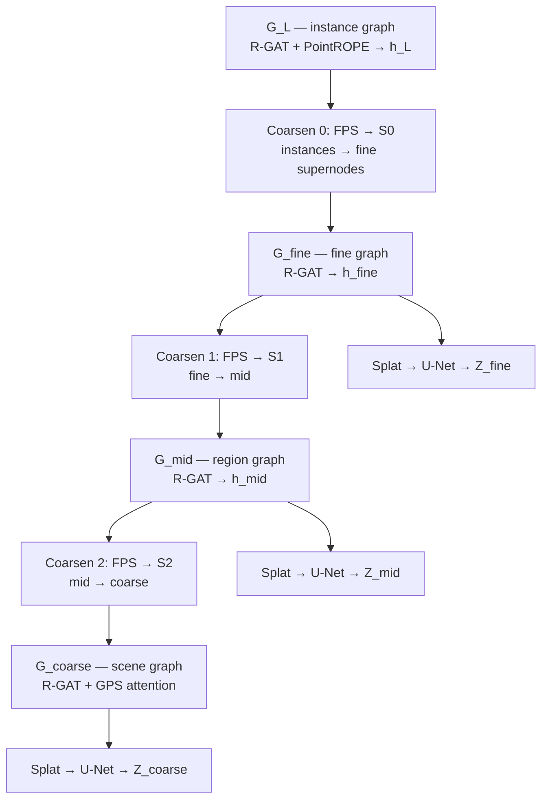

# Architecture

Scene Graph VAE (GVAE): encodes a 3D outdoor scene graph into KL-regularised spatial latent volumes for hierarchical diffusion conditioning.

**Current outputs:** `Z_fine` (64×64×8), `Z_mid` (32×32×8), `Z_coarse` (16×16×4).

---

## Goal

Compress structured layout (object positions, classes, spatial extent) into dense voxel latents the diffusion model can sample from or condition on.

---

## Input

Each scene graph node carries:

| Field | Description |
|-------|-------------|
| `p` | Centroid in scene-normalised `[-1, 1]³` |
| `r` | Footprint semi-axes (axis-aligned extent) |
| `s` | One-hot semantic vector (15 classes) |
| `label` | Class name string |

Edges: proximity (radius graph on `p`). Road edges are planned but not yet in the loss.

Occupancy ground truth: LiDAR voxelised at fine/mid/coarse resolutions (`occ_fine`, `occ_mid`, `occ_coarse`), stored as sidecar `.npy` caches.

---

## B policy (non-instantiable classes)

Ground, vegetation, and fence stay on the **instance graph** (`G_L`) for context but are **excluded from coarsening** (`coarsen_mask=False`). Only instantiable objects participate in FPS coarsening and feed the latent paths.

Config: `COARSEN_EXCLUDE_NON_INSTANTIABLE=True`, `REMOVE_NON_INSTANTIABLE=False`.

---

## Encoder — four-level chain


```mermaid
flowchart TD
    GL["G_L — instance graph\nR-GAT + PointROPE → h_L"]
    C0["Coarsen 0: FPS → S0\ninstances → fine supernodes"]
    GF["G_fine — fine graph\nR-GAT → h_fine"]
    C1["Coarsen 1: FPS → S1\nfine → mid"]
    GM["G_mid — region graph\nR-GAT → h_mid"]
    C2["Coarsen 2: FPS → S2\nmid → coarse"]
    GC["G_coarse — scene graph\nR-GAT + GPS attention"]
    ZF["Splat → U-Net → Z_fine"]
    ZM["Splat → U-Net → Z_mid"]
    ZC["Splat → U-Net → Z_coarse"]
    GL --> C0 --> GF --> C1 --> GM --> C2 --> GC
    GF --> ZF
    GM --> ZM
    GC --> ZC
```

### Instance graph (`G_L`)

- R-GAT with **PointROPE** on Q/K; `D_INSTANCE = 72`.

### Coarsening (three FPS steps)

| Step | Assignment | Ratio (default) | Output |
|------|------------|-----------------|--------|
| S0 | instances → fine | `REDUCTION_RATIO_LEVELS[0]` | `p_fine`, `h_fine` |
| S1 | fine → mid | `[1]` | `p_lm1`, `h_lm1` |
| S2 | mid → coarse | `[2]` | `p_1`, `h_1` |

- **Hard assign** (default): FPS + Voronoi one-hot.
- **Soft assign** (optional): learnable temperature + pool loss.
- Supernode attrs: pooled `p`, soft-mixed `s`, AABB `r`, ball-query edges with per-level radii `BALL_QUERY_RADIUS_LEVELS`.

### Splatting + U-Net

- Anisotropic Gaussian splat, truncated at ±σ (`SPLAT_TRUNCATION_SIGMA`; finer σ on fine via `SPLAT_TRUNCATION_SIGMA_FINE`).
- Optional 1-voxel support cap on fine (`SPLAT_FINE_VOXEL_CAP`).
- 3D U-Net with **GroupNorm** (batch=1 scenes).
- Variational head: sample `Z = μ + σ ⊙ ε`.

| Output | Grid | Latent dim |
|--------|------|------------|
| `Z_fine` | 64 × 64 × 8 | 72 |
| `Z_mid` | 32 × 32 × 8 | 144 |
| `Z_coarse` | 16 × 16 × 4 | 288 |

Grids are **independent fixed volumes**, not nested subdivisions.

---

## Decoder (training signal)

Deformable cross-attention readout:

1. Anchor `(p, r)` from node embedding `h` (**Z-only** by default).
2. 27 reference points on a 3×3×3 grid within the anchor bbox.
3. Bilinear sample `Z`; cross-attend; MLP heads → `ŝ`, `p̂`, `r̂`.

`DECODER_GT_ANCHOR_MIX = 0.0` — no GT geometry for readout queries at train time.

---

## Losses

$$\mathcal{L} = \mathcal{L}_{\text{recon}} + \lambda_{\text{KL}}(t)\,\mathcal{L}_{\text{KL}} + \lambda_{\text{occ}}\,\mathcal{L}_{\text{occ}} + \sum_l \lambda_{\text{grid},l}\,\mathcal{L}_{\text{occ\_grid},l} + \lambda_{\text{pool}}\,\mathcal{L}_{\text{pool}}$$

| Term | Description |
|------|-------------|
| **Recon** | Soft semantic KL, MSE on `p`/`r`, proximity edge margin |
| **KL** | Voxel-wise Gaussian KL; cyclical annealing |
| **Occ** | BCE on query points (`OccupancyReadout`) |
| **Occ grid** | BCE on full voxel grid (`OccGridHead`); optional per level |
| **Pool** | Cut + orthogonality + spatial compactness on `S` (soft mode) |

---

## Validation metrics (primary)

| Metric | Meaning |
|--------|---------|
| `pos_err_fine` | Fine supernode position error |
| `miou_fine` | Hard mIoU on fine supernode labels |
| `occ_iou_fine` | Query readout vs LiDAR cache |
| `inst_pos_err_mid` | Instance position via S0 → S1 → mid recon |
| `pos_err_mid` | Z-only mid supernode position error |
| `occ_iou_mid` | Occupancy vs LiDAR cache |
| `soft_miou_mid` | Diagnostic only |

Set `LOG_FULL_METRICS=True` for extended TensorBoard metrics. Use `utils/probe_latent.py` for anchor ablation and linear Z probes.

---

## Project layout

```
gvae/
├── models/       encoder, decoder, coarsening, splatting, unet3d, occ_grid_head, gvae
├── losses/       gvae_loss, metrics, diagnostics
├── probes/       latent probe library
├── data/         scene_graph, occupancy, voxelize, graph_masks
train.py          single-stage training loop
config.py         hyperparameters
utils/            build_scene_graph, probe_latent, visualize_supernodes, diagnostics
data/graphs/      train/ and test/ JSON + occ sidecars
checkpoint/       run outputs (best.pth, train.log, probe_report.txt)
```

---

## References

- FPS + ball-query: PointNet++ (Qi et al., NeurIPS 2017)
- Pool losses: MinCutPool (Bianchi et al., ICML 2020)
- PointROPE: LitePT (Yue et al., arXiv 2512.13689)
- Cyclical KL: Fu et al. (ACL 2019)
