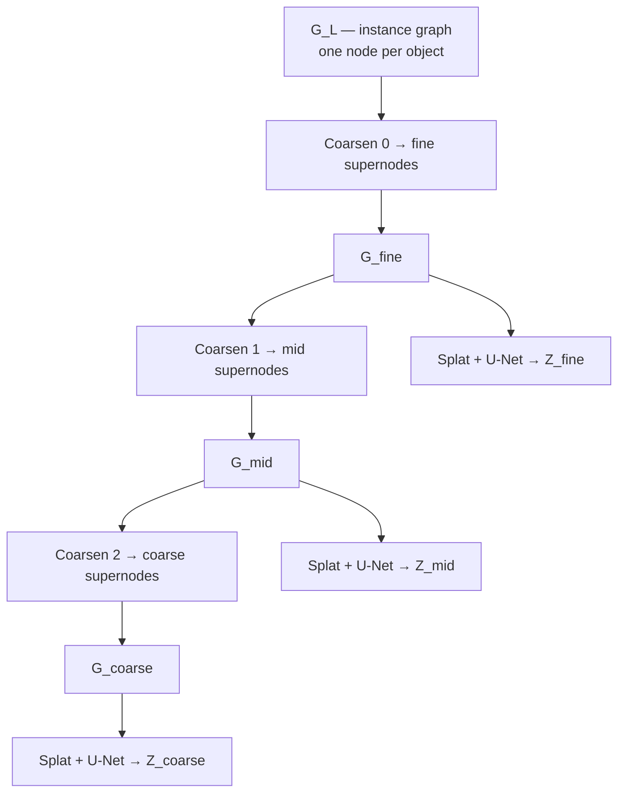

# Architecture

This page explains **how the Scene Graph VAE works**, in order, without assuming you already know VAEs or scene graphs.

---

## The big picture

**Input:** One outdoor scene — a list of objects (position, size, class) and which objects are near each other.

**Output:** Three 3D latent volumes (`Z_fine`, `Z_mid`, `Z_coarse`) that encode layout at three resolutions. A diffusion model can later sample or edit scenes using these volumes.

**Training trick:** The model must not only *produce* good `Z` volumes — it must also *read them back* to reconstruct object attributes. That readout is what keeps `Z` meaningful.

```
Scene graph  →  encode  →  Z_fine, Z_mid, Z_coarse
                              ↓
                         decode (two paths)
                              ↓
                    predicted class, position, size
                              ↓
                         compare to ground truth → loss
```

---

## Input: scene graph + occupancy

Each training scene is a JSON file (see [data.md](data.md)). For every object (node):

| Field | Symbol | Meaning |
|-------|--------|---------|
| Position | `p` | Object center in scene-normalised coordinates `[-1, 1]³` |
| Footprint | `r` | Semi-axes of an axis-aligned box (how big the object is) |
| Semantics | `s` | One-hot vector over 15 classes (car, tree, pole, …) |
| Label | — | Human-readable class name |

**Edges** connect objects whose centers are within a small distance (`EDGE_PROXIMITY`).

**Occupancy caches** (`occ_fine`, `occ_mid`, `occ_coarse`) are binary 3D grids from LiDAR — “was there a point here?” They supervise a separate occupancy head on each `Z` volume.

---

## B policy: background vs objects

Some classes are **non-instantiable** background: ground, vegetation, fence.

- They stay on the **instance graph** so nearby objects get context.
- They are **not coarsened** — they never become supernodes or feed the splat → U-Net path.

Config: `COARSEN_EXCLUDE_NON_INSTANTIABLE=True`.

---

## Encoder: from graph to three `Z` volumes

The encoder runs a **four-level chain**. Each level has graph neural network (GNN) message passing, then (except the last) coarsening.


```mermaid
flowchart TD
    GL["G_L — instance graph\none node per object"]
    C0["Coarsen 0 → fine supernodes"]
    GF["G_fine"]
    C1["Coarsen 1 → mid supernodes"]
    GM["G_mid"]
    C2["Coarsen 2 → coarse supernodes"]
    GC["G_coarse"]
    ZF["Splat + U-Net → Z_fine"]
    ZM["Splat + U-Net → Z_mid"]
    ZC["Splat + U-Net → Z_coarse"]
    GL --> C0 --> GF --> C1 --> GM --> C2 --> GC
    GF --> ZF
    GM --> ZM
    GC --> ZC
```

### Step 1 — Instance graph (`G_L`)

Every object is a node. An **R-GAT** (relational graph attention) with **PointROPE** updates node embeddings `h` using edges and 3D positions. Feature width: `D_INSTANCE = 72`.

### Step 2 — Coarsening (three times)

**Coarsening** merges many nodes into fewer **supernodes** using Farthest Point Sampling (FPS):

| Step | From → To | Default keep ratio |
|------|-----------|-------------------|
| S0 | instances → fine | 20% (`REDUCTION_RATIO_LEVELS[0]`) |
| S1 | fine → mid | 20% |
| S2 | mid → coarse | 20% |

Each supernode gets pooled position, mixed semantics, and a bounding-box footprint. New edges are built with **ball query** (radius grows at coarser levels).

**Hard assignment** (default): each node belongs to exactly one supernode (Voronoi-style).

**Soft assignment** (optional): fuzzy membership + extra pool regularisation losses.

### Step 3 — Splatting

Each supernode’s embedding is **splatted** onto a fixed 3D voxel grid as an anisotropic Gaussian (stretched by `r`). Think of painting a soft blob of features at each object location.

- Fine grid uses a **tighter** Gaussian (`SPLAT_TRUNCATION_SIGMA_FINE = 1.0` vs `2.0` on mid/coarse).
- Fine splat can be **capped** to ~1 voxel radius (`SPLAT_FINE_VOXEL_CAP`) so peaks stay sharp.

### Step 4 — 3D U-Net → variational `Z`

A **3D U-Net** refines the splatted grid and outputs Gaussian parameters `μ` and `log σ²`. We sample:

`Z = μ + σ ⊙ ε`   (standard VAE reparameterisation)

| Output | Grid (H×W×D) | Channels | U-Net depth |
|--------|----------------|----------|-------------|
| `Z_fine` | 64×64×8 | 72 | **3** |
| `Z_mid` | 32×32×8 | 144 | 3 |
| `Z_coarse` | 16×16×4 | 288 | 2 |

Grids are **fixed independent volumes**, not subdivisions of each other.

**GroupNorm** is used inside the U-Net (not BatchNorm) because we often train with one scene per batch element.

---

## Two decoders (why two?)

During training, two decoders reconstruct supernode attributes from `(h, Z)`. They answer different questions:

| Decoder | Uses | Question it answers |
|---------|------|---------------------|
| **h + Z** (`SceneGraphDecoder`) | node embedding `h` **and** volume `Z` | “Given structure **and** latents, where is each object and what is it?” |
| **Z-only** (`ZOnlyDecoder`) | volume `Z` **only** | “If DDM only has `Z` and **known layout slots**, what is at each slot?” |

### h + Z decoder (full readout)

1. Predict an anchor box `(p, r)` from **`h`** (not from ground truth).
2. Place 27 sample points on a 3×3×3 grid inside that box (+ learned offsets).
3. Bilinear-sample **`Z`** at those points; cross-attend → **`z_pred`**; optional shared 2-layer MLP trunk (`USE_Z_PRED_READOUT_MLP`); then predict `ŝ`, `r̂` (and `p̂` when Z-only is off).
4. **`p̂`:** by default `ZOnlyDecoder(Z, p_anchor)` replaces deformable `p` (`Z_ONLY_PATCH_DEFORMABLE_POSITION=True`). With **`--zonly-aux-loss-only`**, Z-only runs are **loss-only**; **`p̂`** comes from deformable **`mlp_p(z_pred)`** at the h-anchor (logs: **`pos`** = deploy path, **`hzpos`** = Z@anchor auxiliary).

`DECODER_GT_ANCHOR_MIX = 0.0` in normal training — anchors come from the model, not from labels. (Probe ablations can blend in GT anchors by raising this value.)

This path drives **`pos_err_fine`** / **`pos_err_mid`** — **`pos` matches `hzpos`** at validation (mix=0).

### Z-only decoder (DDM-aligned readout)

1. Sample **`Z` at ground-truth supernode positions `p`** (with small random jitter during training).
2. A small MLP predicts `ŝ`, `p̂`, `r̂` — **no `h`**.

**Important nuance:** Using GT `p` as the *sample location* does **not** remove position from the loss — the MLP still outputs `p̂` and we penalise `‖p̂ − p‖`. What GT `p` provides is **where to look in the volume**, not the answer. This matches the DDM contract: layout slots are known; `Z` fills in appearance and local geometry at those slots.

Jitter (`Z_ONLY_QUERY_JITTER = 0.05`) forces `Z` to be informative in a small neighborhood, not only at a single voxel.

This path drives **`pos_err_zonly_*`** (console: `zpos=`). For **global** localization evidence, also check h-decoder metrics and offline probes (see [training.md](training.md#latent-probes)).

---

## Occupancy head

Each `Z` level has an **`OccGridHead`**: a small conv network that predicts occupancy logits for **every voxel** in the grid. Loss is binary cross-entropy against the LiDAR cache (with automatic class imbalance weighting).

This replaces older designs that sampled random query points for occupancy.

---

## Loss function

Total loss per branch (fine / mid / coarse) combines:

$$\mathcal{L} = \lambda_h \mathcal{L}_{\text{recon\_h}} + \lambda_z \mathcal{L}_{\text{recon\_zonly}} + \lambda_{hz} \mathcal{L}_{\text{recon\_hzonly}} + \lambda_{\text{anc}}\mathcal{L}_{\text{anchor}} + \lambda_{\text{KL}}(t)\,\mathcal{L}_{\text{KL}} + \lambda_{\text{grid}}\,\mathcal{L}_{\text{occ\_grid}} + \lambda_{\text{norm}}\,\mathcal{L}_{\text{norm\_contrast}} + \lambda_{\text{pool}}\,\mathcal{L}_{\text{pool}}$$

| Term | Default weight | What it does |
|------|----------------|--------------|
| **Recon h** | `LAMBDA_RECON_H = 1.5` | Soft CE on class + MSE on `p`/`r` via h+Z path (`p` from ZOnlyDecoder at anchor) |
| **Recon zonly** | `LAMBDA_RECON_ZONLY = 1.0` | Same targets via Z-only decoder at GT slots (+ train jitter) |
| **Recon hzonly** | `LAMBDA_RECON_HZONLY = 0.8` | Z-only readout at h-predicted anchors (partially redundant with h recon for `p` when zonly pos readout is on) |
| **Anchor** | `LAMBDA_ANCHOR_FINE = 1.0`, `MID = 0.5` | MSE on `p_anchor` vs GT supernode centres (fine / mid) |
| **KL** | cyclical → `LAMBDA_KL_MAX = 1e-3` | Regularise `μ, σ` toward standard normal |
| **Occ grid** | `LAMBDA_OCC_GRID_* = 1.0` | Voxel occupancy BCE (`OccGridHead`) |
| **Norm contrast** | `0.1` fine & mid | Hinge: push `‖Z(p_gt)‖` above `‖Z(empty voxel)‖` (Probe C alignment) |
| **Pool** | soft mode only | Keep coarsening assignments compact and separated |

**Anchor curriculum:** during training, `DECODER_GT_ANCHOR_MIX` blends GT into h-decoder reference boxes (1→0 over 40 epochs by default); validation always uses mix=0. See [training.md](training.md#command-line-overrides).

**Reconstruction** at each supernode uses soft cross-entropy for semantics, MSE for position (`LAMBDA_POS`), and log-space Smooth-L1 for footprint (`LAMBDA_SIZE`; Z-only paths use `LAMBDA_SIZE_ZONLY`). Anchor footprints use `LAMBDA_ANCHOR_R_*` on `r_anchor(h)`.

**KL annealing** cycles over training (Fu et al., 2019) so the model repeatedly explores then regularises.

Localization experiment arc and recommended λ overrides: [localization-progress.md](localization-progress.md).

---

## Validation metrics (what the console shows)

| Metric | Decoder / source | Good direction | Plain meaning |
|--------|------------------|----------------|---------------|
| `pos` (`pos_err_fine`) | h+Z (`p` from Z@anchor by default) | lower | Fine supernode position — **localization** |
| `hzpos` | Z-only @ `p_anchor` | lower | Same as `pos` with default Z-only decoder |
| `zpos` (`pos_err_zonly_fine`) | Z-only @ GT slot | lower | Oracle slot readout (DDM with known layout) |
| `anc` (`anchor_err_fine`) | `mlp_p_anchor(h)` | lower | Anchor placement error before Z refinement |
| `smiou` | h + Z (deformable) | higher | Semantic reconstruction on fine supernodes |
| `zsmiou` | Z-only @ GT | higher | Z-only semantic readout at GT slots |
| `occ` | OccGridHead | higher | Predicted vs LiDAR occupancy (fine grid IoU) |
| `pred` / `rec` | OccGridHead | — | Occupancy pred rate / recall (over-pred diagnostic) |
| `inst` (`inst_pos_err_mid`) | h + Z chain | lower | Instance position via S0→S1→mid decode |
| mid `zpos`, `anc`, `hzpos`, `smiou` | same pattern | — | Mid supernode equivalents |

Set `LOG_FULL_METRICS=True` for extra TensorBoard scalars (hard mIoU, coarse level, KL breakdown, …).

See [localization-progress.md](localization-progress.md) for current benchmark numbers and training recipe.

---

## Code layout

```
gvae/
├── models/       encoder, decoder, coarsening, splatting, unet3d, occ_grid_head, gvae
├── losses/       gvae_loss, metrics, diagnostics
├── probes/       offline latent probe library
├── data/         scene_graph, occupancy, voxelize, graph_masks
train.py          training loop
config.py         all hyperparameters
utils/            build_scene_graph, probe_latent, visualize_supernodes, diagnostics
```

---

## References

- FPS + ball-query: PointNet++ (Qi et al., NeurIPS 2017)
- Pool losses: MinCutPool (Bianchi et al., ICML 2020)
- PointROPE: LitePT (Yue et al., arXiv 2512.13689)
- Cyclical KL: Fu et al. (ACL 2019)
