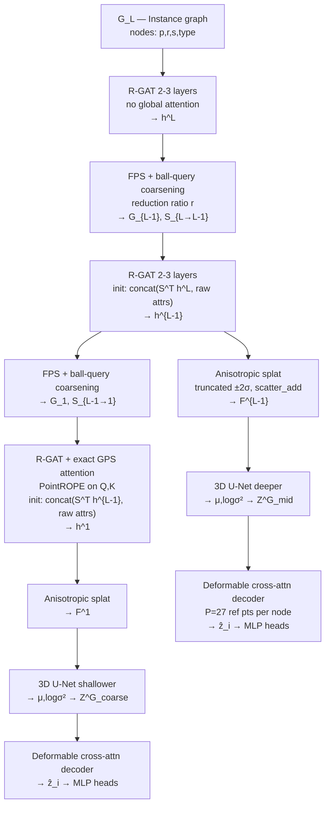

> **Deprecated.** Original Cursor implementation plan (May 2025).  
> Superseded by [../architecture.md](../architecture.md) and [../../TODO.md](../../TODO.md).  
> Kept for historical reference. Feature dims, decoder, and losses below are **out of date**.

---

## Implementation status (as of PR1)

| Original todo | Status | Notes |
|---------------|--------|-------|
| scaffold | **done** | `D_MODEL_LEVELS = [72, 144, 288]` not d=192 |
| data | **done** | LiDAR occ caches, B policy |
| coarsening | **done** | + `S.detach()` on feature path |
| gps | **done** | PointROPE in R-GAT |
| splatting | **done** | |
| unet3d | **done** | GroupNorm |
| encoder | **done** | |
| decoder | **done** | PR1: Z-only anchors, not GT footprint |
| gvae | **done** | |
| losses | **done** | Soft semantic KL, not CE |
| train | **done** | 4 stages, grad clip |
| **Layer A / Z_fine** | **pending** | See TODO.md PR2 |

---

---
name: Scene Graph VAE
overview: Implement a standalone Scene Graph Variational Autoencoder (GVAE) that encodes a 3D outdoor scene graph into two dense KL-regularised spatial latent volumes (Z^G_coarse, Z^G_mid) at the two coarsest voxel resolutions of the diffusion hierarchy, providing a geometrically grounded layout prior.
todos:
  - id: scaffold
    content: "Create project scaffold: directory structure, requirements.txt, config.py with explicit voxel resolutions (8×8×4, 16×16×8), d=192, reduction ratio r, λ weights"
    status: completed
  - id: data
    content: "Implement SceneGraph data class: (p, r, s, type) node attrs, proximity+road edges, per-scene normalisation to [-1,1]³, voxelised occupancy ground truth"
    status: completed
  - id: coarsening
    content: "Implement FPS+ball-query coarsening (primary, deterministic, spatially contiguous) with soft MinCutPool assignment S retained only for the pooling regularisation losses; derive supernode p, r, s differentiably from S"
    status: completed
  - id: gps
    content: "Implement GPS layer: R-GAT local stream (type-specific R-GAT, edge features) + exact attention at coarse level; replace RWPE with PointROPE applied to Q/K (d=192 divisible by 6)"
    status: completed
  - id: splatting
    content: "Implement anisotropic Gaussian splatting with ±2σ kernel truncation and scatter_add; O(Σ|N_i|) complexity"
    status: completed
  - id: unet3d
    content: Implement configurable-depth 3D U-Net with skip connections for spatial densification
    status: completed
  - id: encoder
    content: "Assemble three-level sequential encoder: instance R-GAT on G_L → FPS pool → region R-GAT on G_{L-1} (init from pooled h^L) → FPS pool → coarse R-GAT+GPS on G_1 (init from pooled h^{L-1}) → Splat → UNet3D → bottleneck"
    status: completed
  - id: decoder
    content: "Implement per-level decoder: deformable cross-attention readout (P=27 reference points per node, footprint-guided) + MLP heads (s, p, r) + radius-graph consistency loss for edge reconstruction"
    status: completed
  - id: gvae
    content: "Assemble top-level GVAE forward pass returning Z^G_coarse, Z^G_mid and all reconstructions; implement stage-wise training flag to freeze earlier stages"
    status: completed
  - id: losses
    content: "Implement all loss terms: recon (radius-graph edge + CE semantic + MSE position/footprint), voxel-wise KL with cyclical annealing, occupancy (GT from 3D scene), FPS+MinCutPool pool losses"
    status: completed
  - id: train
    content: "Write stage-wise training loop: stage 1 coarsening only, stage 2 add mid encoder, stage 3 add coarse encoder, stage 4 joint fine-tune; KL cyclical annealing schedule"
    status: completed
isProject: false
---

# Scene Graph VAE — Implementation Plan

*(Original draft — see status table at top for current state.)*

## Spatial Configuration

Scenes range 100–500 m. All coordinates are normalised **per scene** to `[-1, 1]³` (translate to centroid, scale by longest axis). This makes kernels, Fourier encodings, and voxel grids operate at consistent frequencies regardless of absolute scene scale. Feature dimension `d = 192` (required by PointROPE: must be divisible by 6).

| Level | Grid | Voxels | Normalised voxel size |
|---|---|---|---|
| Coarse (diffusion level 1) | 8 × 8 × 4 | 256 | 0.25 (→ 12–62 m physical) |
| Mid (diffusion level 2) | 16 × 16 × 8 | 2 048 | 0.125 (→ 6–31 m physical) |

## Architecture Summary

Three-level sequential graph encoder chain feeding two latent volumes. The coarsening and voxel resolution hierarchies are fully decoupled.

*(Remainder unchanged from original plan — decoder now uses h-predicted anchors; recon uses soft semantic KL.)*
