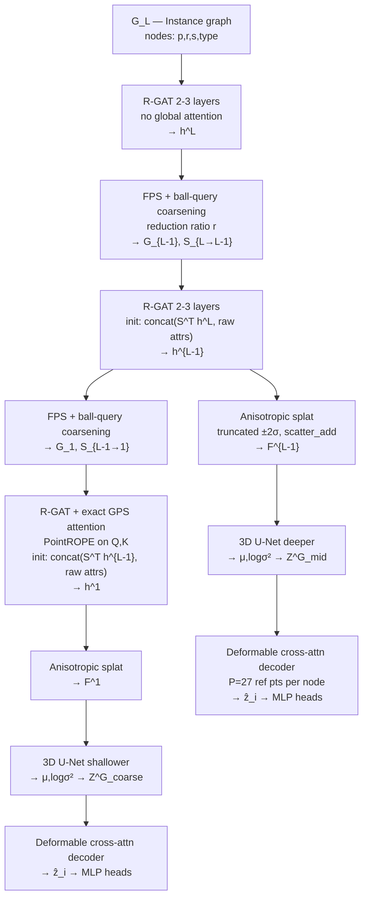

# Scene Graph VAE — Implementation Plan

## Spatial Configuration

Scenes range 100–500 m. All coordinates are normalised **per scene** to `[-1, 1]³` (translate to centroid, scale by longest axis). This makes kernels, Fourier encodings, and voxel grids operate at consistent frequencies regardless of absolute scene scale. Feature dimension `d = 192` (required by PointROPE: must be divisible by 6).

| Level | Grid | Voxels | Normalised voxel size |
|---|---|---|---|
| Coarse (diffusion level 1) | 8 × 8 × 4 | 256 | 0.25 (→ 12–62 m physical) |
| Mid (diffusion level 2) | 16 × 16 × 8 | 2 048 | 0.125 (→ 6–31 m physical) |

## Architecture Summary

Three-level sequential graph encoder chain feeding two latent volumes. The coarsening and voxel resolution hierarchies are fully decoupled.



## Sequential Encoder Chain

**Instance level (G_L).** Raw node features `[s_i; log r_i; embed(type_i)]` projected to `d`, with PointROPE applied to Q/K inside R-GAT attention. Edge features: `[‖p_i-p_j‖; embed(type_ij)]`. Output: `h^L ∈ ℝ^{|V_L| × d}`.

**Coarsening G_L → G_{L-1}.** FPS samples `⌊|V_L|/r⌋` seed nodes by 3D position (deterministic, spatially spread, no degenerate solutions). Each remaining node is hard-assigned to its nearest seed. Soft assignment `S_{L→L-1}` (from a lightweight MLP over distances) is retained only to compute the pool regularisation losses. Supernode attributes:
- `p̄_j = Σ_i S_{ij} p_i / Σ_i S_{ij}` (weighted centroid)
- `r̄_j = AABB( {r_i : argmax_j S_{ij} = j} )` (bounding box of hard cluster)
- `s̄_j = S^T s / ‖S[:,j]‖₁` (soft semantic mix)

**Region level (G_{L-1}).** Node input: `Linear([S^T h^L ; s̄; log r̄; embed(type)]) → d`. R-GAT 2-3 layers + PointROPE. Output: `h^{L-1}`.

**Coarsening G_{L-1} → G_1.** Same FPS+ball-query with second reduction ratio `r`.

**Scene level (G_1).** Node input: `Linear([S^T h^{L-1} ; raw attrs]) → d`. R-GAT + **exact multi-head attention** (node count is small: ~10–30). PointROPE on Q/K. Output: `h^1`.

**Splatting (both levels).** Anisotropic Gaussian kernel truncated at `±2σ` per axis. Only voxels within `[p_i - 2r_i, p_i + 2r_i]` are evaluated. `F_v = scatter_add(w_iv h_i) / (scatter_add(w_iv) + ε)`. Complexity: `O(Σ_i |N_i|)`.

**3D U-Net.** Shallower at coarse level (large supernodes → dense coverage); deeper at mid level (smaller footprints → sparser coverage requiring more inpainting). Both use skip connections.

**Variational bottleneck.** Final conv: `(μ, log σ²) ∈ ℝ^{H×W×D×d}`. `Z = μ + σ ⊙ ε, ε ~ N(0,I)`.

## Decoder (Training Signal Only)

Trilinear interpolation is replaced by **deformable cross-attention** readout — the structural inverse of splatting.

For each node `i`, `P = 27` reference points are initialised on a 3×3×3 grid within the bounding box `[p_i - r_i, p_i + r_i]`, then offset by a learned `Δ_p = MLP_offset(h_i)`. The readout:

```
Q_i = MLP_Q(h_i)
ref_pts_i = grid_3x3x3(p_i, r_i) + MLP_offset(h_i)   [P=27 points]
K_p, V_p  = MLP_K(Z^G[ref_pts_i]), MLP_V(Z^G[ref_pts_i])   [bilinear interp at ref pts]
ẑ_i = CrossAttn(Q_i, K, V)   [P keys/values, cost O(P·d) per node]
```

MLP heads: `ŝ_i = Softmax(MLP_s(ẑ_i))`, `p̂_i = MLP_p(ẑ_i)`, `r̂_i = Softplus(MLP_r(ẑ_i))`.

**Edge reconstruction.** Proximity edges are implicit in position, so instead of BCE on `Â = σ(ẑẑᵀ)`:

$$\mathcal{L}_{\text{edge}} = \frac{1}{|E|}\sum_{(i,j)\in E}\max(0,\|\hat{p}_i-\hat{p}_j\|-\delta) + \frac{1}{|E^-_\text{samp}|}\sum_{(i,j)\notin E}\max(0,\delta-\|\hat{p}_i-\hat{p}_j\|)$$

Road connectivity edges (non-distance-based): retain binary BCE with positive class weight `|V|²/(2|E_road|)` and 1:5 negative sampling.

**Occupancy readout.** For query point `q`: `Q_q = MLP_Q(Fourier(q))`, cross-attend to `Z^G` within a fixed-radius neighbourhood (no footprint available). `ô_q = σ(MLP(Q_q, ẑ_q))`.

## Graph Coarsening Details

FPS produces geometrically sound clusters by construction. The soft `S` from a small MLP over `‖p_i - p̄_j‖ / r̄_j` is used **only** for:
- `L_cut` and `L_ortho` (MinCutPool auxiliary losses) as regularisation
- `L_spatial = Σ_{i,j} S_{ij} ‖p_i - p̄_j‖²` as soft spatial compactness penalty
- Differentiable pooling of `h` for the inheritance: `h̃_j = S^T h / ‖S[:,j]‖₁`

The hard cluster assignment from FPS defines the actual supernodes; `S` provides gradients only through the losses.

## Loss Functions

$$\mathcal{L}_{\text{GVAE}} = \mathcal{L}_{\text{recon}} + \lambda_{\text{KL}}(t)\,\mathcal{L}_{\text{KL}} + \lambda_{\text{occ}}\,\mathcal{L}_{\text{occ}} + \lambda_{\text{pool}}\,\mathcal{L}_{\text{pool}}$$

- **Recon**: `L_edge + CE(ŝ, s) + MSE(p̂, p) + MSE(r̂, r)` summed over both levels
- **KL**: voxel-wise `KL(N(μ_v,σ_v²) ‖ N(0,I))` normalised by grid volume; `λ_KL(t)` follows a **cyclical annealing** schedule (Fu et al., 2019): linear ramp 0→β, hold, repeat
- **Occ**: BCE between `ô_q` and binary voxel occupancy from the actual 3D scene at the target resolution; query points sampled half inside, half outside occupied voxels
- **Pool**: `L_cut + L_ortho + L_spatial` at each coarsening step

## Stage-wise Training

Stage 1 (coarsening): train FPS+soft-S and pool losses only — freeze all encoders and decoders. Ensures stable supernodes before any gradient propagates through the inheritance chain.
Stage 2 (mid branch): unfreeze instance R-GAT, first coarsening, region R-GAT, splat, mid U-Net, mid decoder. λ_KL annealing starts.
Stage 3 (coarse branch): unfreeze second coarsening, coarse R-GAT+GPS, coarse splat, coarse U-Net, coarse decoder.
Stage 4 (joint): unfreeze all. Reduced learning rate. Full loss active.

## Project Structure

```
gvae/
├── models/
│   ├── gvae.py          # Top-level: three-level encoder chain + two decoder branches
│   ├── encoder.py       # Per-level: R-GAT+PointROPE → Splat → UNet3D → bottleneck
│   ├── decoder.py       # Deformable cross-attn readout + MLP heads + edge losses
│   ├── coarsening.py    # FPS+ball-query (hard) + soft-S MLP + supernode attr derivation
│   ├── gps.py           # GPS layer: R-GAT local + exact attention (coarsest); PointROPE
│   ├── unet3d.py        # 3D U-Net, configurable depth
│   └── splatting.py     # Truncated anisotropic Gaussian splatting, scatter_add
├── losses/
│   └── gvae_loss.py     # All loss terms + cyclical KL schedule
├── data/
│   ├── scene_graph.py   # SceneGraph data class; per-scene normalisation to [-1,1]³
│   └── occupancy.py     # 3D scene voxelisation for occupancy GT
├── train.py             # Stage-wise training loop
├── config.py            # d=192, grids, r, λ weights, annealing schedule
└── requirements.txt
```

## Key Dependencies

- `torch` + `torch_geometric` — graph ops, R-GAT, dense MinCutPool losses
- `torch_cluster` — FPS and radius-graph for ball-query coarsening
- `torch_scatter` — scatter_add for truncated splatting
- Standard `torch.nn` 3D convolutions for U-Net
- PointROPE: implement from LitePT (Yue et al., arXiv 2512.13689); CUDA kernel available at [github.com/prs-eth/LitePT](https://github.com/prs-eth/LitePT)

## Key References

- FPS+ball-query hierarchy: PointNet++ (Qi et al., NeurIPS 2017)
- MinCutPool losses: Bianchi et al. (ICML 2020)
- PointROPE: LitePT (Yue et al., arXiv 2512.13689)
- Deformable attention: Deformable DETR (Zhu et al., ICLR 2021)
- Cyclical KL annealing: Fu et al. (ACL 2019)
- Convolutional occupancy: ConvONet (Peng et al., ECCV 2020)